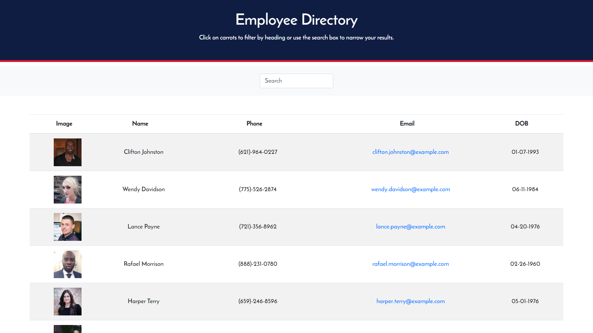

# Employee Directory

## Introduction

View a list of employees in a company with the ability to search and sort by name, email, phone number, and date of birth, ascending or descending.

This app runs on `react` on Node.js.

[Live Demo](https://sleepy-wave-05362.herokuapp.com/)

## Installation

**Node.js v13+** is required in order to run this script.

1. Download or clone this repository into your local computer.
2. In your terminal, browse to the folder and run `npm install --production`.

## Usage

1. In your terminal, run the script with the command `npm start`. This will run a local server that hosts the web app on port 3000.
2. Visit `http://localhost:3000` to access the web app.
3. Enter a search term into the text input or click on the headers to sort it respectively.

## Preview

